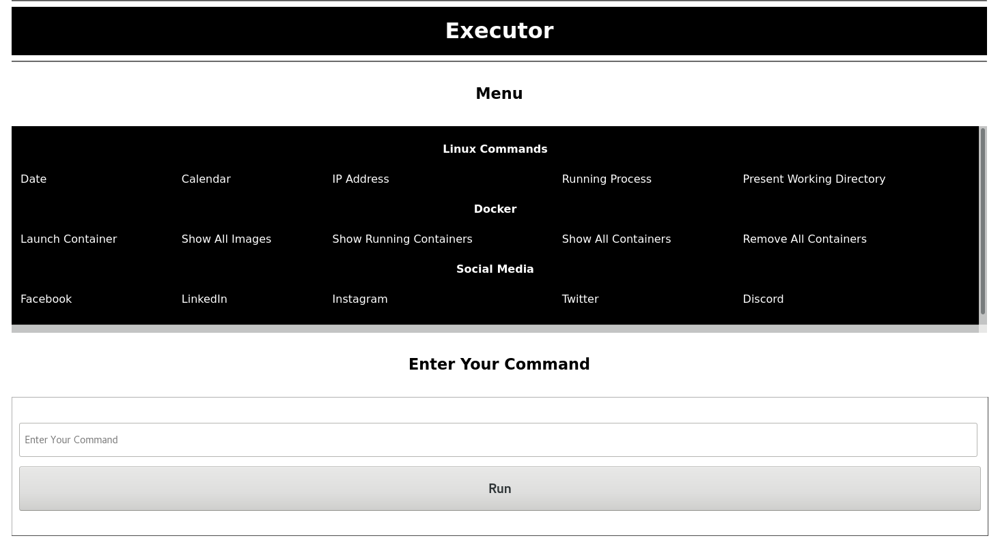

# web-assistant
A Python CGI Application To Run Linux Commands.

**Python 3.x Modules Used :**

- **[sys](https://docs.python.org/3/library/sys.html)**
- **[cgi](https://docs.python.org/3/library/cgi.html)**
- **[platform](https://docs.python.org/3/library/platform.html)**
- **[subprocess](https://docs.python.org/3/library/subprocess.html)**

**Requirements :**

- **pip3**
- **python3.x**
- **web server**

### *Screenshots :*

